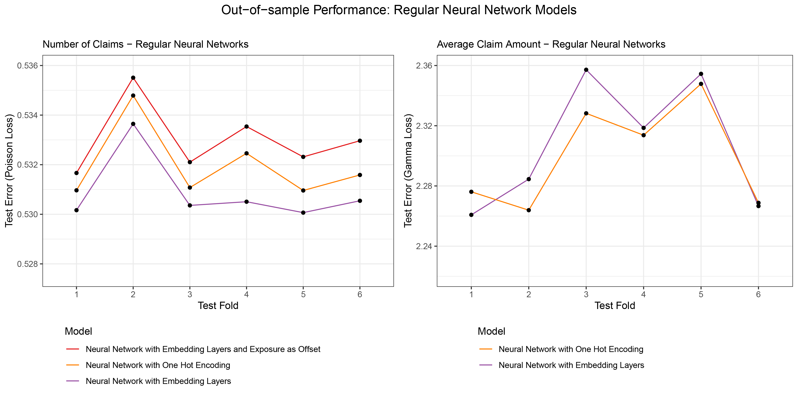
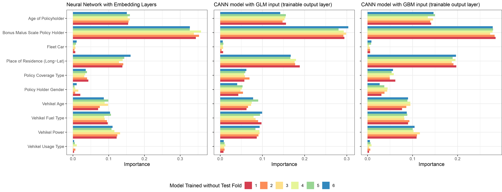

```{r setup, include=FALSE}
options(htmltools.dir.version = FALSE)
library(knitr)
knitr::opts_chunk$set(warning = FALSE, message = FALSE)
# options(knitr.table.format = "html")
library(tidyverse)
library(fontawesome) # from github: https://github.com/rstudio/fontawesome 
library(DiagrammeR)
#library(emo) # from github: https://github.com/hadley/emo
library(gt) # from github: https://github.com/rstudio/gt
#library(countdown) # from github: https://github.com/gadenbuie/countdown 
library(here)
```

```{r setup_greenwell, include=FALSE}
# Set global R options
options(htmltools.dir.version = FALSE, servr.daemon = TRUE, 
        crayon.enabled = TRUE)

# Set global knitr chunk options
knitr::opts_chunk$set(
  dev = "svg",
  fig.align = "center",
  cache = TRUE,
  error = FALSE,
  message = FALSE, 
  warning = FALSE, 
  collapse = TRUE 
)

# colors - I copied most of these from # https://github.com/edrubin/EC524W20
dark2 <- RColorBrewer::brewer.pal(8, name = "Dark2")
KULbg <- "#116E8A"
red_pink   = "#e64173"
turquoise  = "#20B2AA"
orange     = "#FFA500"
red        = "#fb6107"
blue       = "#3b3b9a"
green      = "#8bb174"
grey_light = "grey70"
grey_mid   = "grey50"
grey_dark  = "grey20"
purple     = "#6A5ACD"
slate      = "#314f4f"
```

class: bottom, left, title-slide, clear

background-image: url('img_f/beamer_title_KUL.png')
background-size: contain

name: titlepage

# Neural Network-based models for Non-Life Insurance Pricing

<html><div style='float:left'></div><hr color='#FAFAFA' size=1px width=100%></html>

<span style="color:#FAFAFA;font-size:18.0pt">
Master Thesis Presentation <br>
Freek Holvoet <br>
28 May 2021 <br>
</span>

<span style="color:#FAFAFA;font-size:14.0pt">
Promotor: Prof. Dr. Katrien Antonio<br>
Work leader: ir. Roel Henckaerts <br>
</span>
---

name: introduction

# Introduction

### Pure risk premium calculation

- Technical premiums defined by the expected loss

- In P&C often the frequency-severity approach is used


$$
\pi = \mathbb{E}\left(\frac{L}{e}\right) \stackrel{\tiny\text{indep.}}{=} \mathbb{E}\left(\frac{N}{e}\right) \times \mathbb{E}\left(\frac{L}{N}\; \middle|\; N>0\right) = \mathbb{E}(F)\times\mathbb{E}(S)
$$


### Predictive models

Many options exist: GLM, GAM, decision trees, ensemble methods, Tweedie compound Poisson-gamma models, neural networks, support vector machines,...


- Binned GLM:  [Henckaerts et al. (2018)](#references) uses GAMs together with tree-based clustering, to bin continuous variables for a GLM

- Gradient Boosting:  [Henckaerts et al. (2020)](#references) uses GBMs for both frequency and severity modelling


---

# Neural Networks

Fully-connected feed-forward neural networks

.center[
<embed src="./img_f/NN_animation.gif" width="60%">
]

Each layer a weighted combination of the previous layer, with an activation function $\sigma$

$$\boldsymbol{\text{layer}_i} = \sigma(\mathbf{W}\,\boldsymbol{\text{layer}_{i-1}} + \boldsymbol{\beta})$$

---

# Combined Actuarial Neural Networks

Combined Actuarial Neural Networks (.hi-pink[CANN]), proposed by [Scheldorfer and Wutrich (2019)](#references)

.center[
<embed src="./img_f/CANN_animation.gif" width="70%">
]

An .hi-pink[initial model] is added with a skip connection to the output layer. The neural network part is called the .hi-pink[adjustment model]

---

# Combined Actuarial Neural Networks

Combined Actuarial Neural Networks (.hi-pink[CANN]), proposed by [Scheldorfer and Wutrich (2019)](#references)

.center[
<embed src="./img_f/CANN_animation.gif" width="70%"> ]

.pull-left[
.KULbginline[Fixed CANN setup]
]
.pull-right[
.KULbginline[Flexible CANN setup]
]

.font80[
$$
\begin{array}{ccc}
f^{fixed}\left( \boldsymbol{x}_i,\hat{y}_i^{(in)}\right) = \exp\left(\ln\left( \hat{y}_i^{(in)}\right) + \hat{y}_i^{(adj)}\right) & 
\hspace{230px}
f^{flexible}\left( \boldsymbol{x}_i,\hat{y}_i^{(in)}\right) = \exp\left( \begin{bmatrix} w_1 & w_2 \end{bmatrix}\cdot\begin{bmatrix}\ln(\hat{y}_i^{(in)}) \\ \hat{y}_i^{(adj)}\end{bmatrix} + \beta\right)
\end{array} 
$$
]

---

# Bias regularization

### Balance property

In a model $f(\boldsymbol{x})$ with perfect balance

$$ \sum_i f(\boldsymbol{x}_i) = \sum_i y_i. $$
.KULbginline[Important in insurance:] premiums are defined on portfolio level

### GLM bias regularization

[Wutrich (2020)](#references) proposes the use of GLM bias regularization to restore balance in neural network models.

- GLM with natural link possesses the balance property

- Using the last hidden layer of a neural network as input in a GLM to restore balance in the neural network

---

name: outofsample

# Out-of-sample performance
### Neural network results

.center[
```{r out.width = '80%', out.height = '50%', echo=FALSE}

```
]

---

# Out-of-sample performance
### CANN model results

.center[
```{r out.width = '80%', out.height = '50%', echo=FALSE}
knitr::include_graphics("./img_f/OOS_CANN_freq_vs_sev.png")
```
]

---

name: brresults

# Out-of-sample performance
### Effect of bias regularization

.center[
```{r out.width = '60%', out.height = '50%', echo=FALSE}
knitr::include_graphics("./img_f/BReffect_Freq_CANNs.png")
```
]

---

name: interpretation

# Model interpretational tools

.pull-left[
### Variable importance plot

- Permutate each variable $\ell$ 

- Calculate the difference in prediction between the unpermutated, and the permutated sample data set 

<br>

$$\text{VIP}_{\ell} = \frac{1}{n}\sum_{i=1}^{n}\left( f_{\text{model}}(\boldsymbol{x}_i) - f_{\text{model}}\left(\boldsymbol{x}_i^{\text{perm},\ell}\right) \right)$$

]

.pull-right[
### Partial dependency plot

- Fix the value of variable $\ell$ 

- Iterate over all possible values 

- Look at the average prediction in function of the variables value

$$\text{PDP}(x_{\ell}) = \frac{1}{n}\sum_{i=1}^{n}f_{\text{model}}(\boldsymbol{x}_{\ell},\boldsymbol{x}^*_i)$$

]

.footnote[Reference: [Molnar (2019)](#references)]

---

# Model interpretational tools

### Variable importance plot

A permutational approach to asses the importance of each variable in the claim frequency model.

.center[
```{r out.width = '80%', out.height = '50%', echo=FALSE}

```
]

---

# Model interpretational tools

### Partial dependency plot: Policyholder age

Effect of the policyholder age on the predicted claim severity.

.center[
```{r out.width = '80%', out.height = '50%', echo=FALSE}
knitr::include_graphics("./img_f/PDP_Freq_ageph.png")
```
]

---

# Model interpretational tools

### Partial dependency plot: Postal code

Effect of the postal code on the predicted number of claims.

.center[
```{r out.width = '80%', out.height = '50%', echo=FALSE}
knitr::include_graphics("./img_f/PDP_NC_spatial_comparison.png")
```
]

---

name: references
# References

.font90[
Ian Goodfellow, Yoshua Bengio, and Aaron Courville. <i>Deep Learning</i>. MIT Press, 2016.]

.font90[
Roel Henckaerts, Katrien Antonio, Maxime Clijsters, and Roel Verbelen. A data driven binning strategy
for the construction of insurance tariff classes. <i>Scandinavian Actuarial Journal</i>, 2018(8):681–705, 2018.]

.font90[
Roel Henckaerts, Marie Pier Cote, Katrien Antonio, and Roel Verbelen. Boosting Insights in Insurance
Tariff Plans with Tree-Based Machine Learning Methods. North American Actuarial Journal, pages 1–31, 2020.]

.font90[
Christoph Molnar. <i>Interpretable Machine Learning</i>. christophm.github.io/interpretable-ml-book, 2019.]

.font90[
Jurg Schelldorfer and Mario V. Wuthrich. Nesting Classical Actuarial Models into Neural Networks.
<i>SSRN Electronic Journal</i>, pages 1–27, 2019.]

.font90[
Mario V. W¨uthrich. Bias regularization in neural network models for general insurance pricing. <i>European
Actuarial Journal</i>, 10(1):179–202, 2020.]

<br>
<br>
<br>

Slides created with the R package  [xaringan](https://github.com/yihui/xaringan).<br>
Presentation template from `r fa(name = "github", fill = KULbg)` https://github.com/katrienantonio/hands-on-machine-learning-R-module-1


